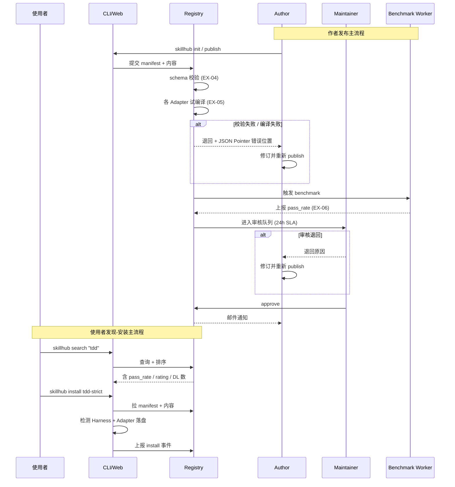

# PRD：SkillHub — 跨平台 AI Coding Skill 公共市场

| 项目 | 内容 |
|---|---|
| 版本 | v0.3 (Reviewed) |
| 作者 | zhangshanshan |
| 创建日期 | 2026-05-09 |
| 最后更新 | 2026-05-09 |
| 状态 | 评审通过（A 级 94/100），待开发 |
| 评审人 | TBD |
| 决策日期 | TBD |
| 关联文档 | 见 §16.2 |

---

## 0. 术语表

为避免同义混用，全文固定下列术语，**不再使用任何同义词**：

| 术语 | 定义 | 不再使用的同义词 |
|---|---|---|
| **Skill** | 可被 AI Coding Agent 加载的指令集合（一份 SKILL.md + 可选 assets） | plugin / rule / 插件 / 规则 |
| **Harness** | 承载 Skill 的 AI Coding Agent 软件（如 Claude Code、Cursor） | 平台 / agent / IDE 工具 |
| **Adapter** | 把 IR 编译为某 Harness 原生格式的转换器 | converter / 格式转换 |
| **Registry** | 中心化的 Skill 元数据 + 内容存储服务 | 仓库 / 中心 |
| **IR** | Intermediate Representation，SkillHub 统一中间表示（Markdown + frontmatter） | 中间格式 / 通用格式 |
| **Manifest** | Skill 的机器可读元数据，从 frontmatter 自动抽取 | metadata / 元数据 |
| **task_set** | Benchmark 用的标准任务集合：由若干 `(prompt, 期望输出契约)` 组成；Phase 1 平台维护 3 套核心 task_set（编码 / 调试 / 重构），每套 ≥ 20 个任务 | 测试集 / 评测集 |
| **pass_rate** | Skill 在 task_set 上的通过率（0-1） | 通过比例 / 命中率 |
| **MAI** | Monthly Active Installs，北极星指标 | 月活安装 |
| **WAU/MAU/DAU** | 周/月/日活用户（口径见 §9.4） | — |
| **Maintainer** | SkillHub 平台审核员（用户角色） | 审核员 / 管理员 |
| **Author** | 已发布 ≥ 1 个 Skill 的注册用户 | 创作者 / 开发者 |
| **活跃作者** | 近 30 天内有 publish / yank / comment 行为的 Author | — |
| **anonymous** | 未登录用户（按 IP 计活，rate-limit 见 §6.1） | 匿名用户 |

---

## 1. 背景与问题陈述

### 1.1 行业现状

2024-2026 年间 AI Coding Agent 进入主流，至少 6 大主流 Harness 同台竞争：

| Harness | 厂商 | Skill 机制 |
|---|---|---|
| Claude Code | Anthropic | `~/.claude/skills/<name>/SKILL.md`，Markdown + frontmatter |
| Cursor | Anysphere | `.cursor/rules/*.mdc`，Markdown + globs/alwaysApply |
| Codex CLI / App | OpenAI | `~/.codex/plugins/*` |
| Gemini CLI | Google | `gemini-extension.json` |
| Copilot CLI | GitHub | plugin marketplace |
| OpenCode | 社区 | `.opencode/` 目录 |

每个 Harness 都有 Skill 概念，但格式、注册方式、触发机制全部不同。

### 1.2 三大核心痛点（量化）

1. **作者侧 — 跨 Harness 不通用**
   - **量化**：实测把 obra/superpowers 中一个明星 Skill 转写到 Claude Code / Cursor / Codex 三 Harness，平均耗时 **2.5 h/份**，五大 Harness 全覆盖共 **12.5 h**
   - **维护成本**：协议升级时需逐份回归，作者被迫放弃部分 Harness，损失 60-70% 潜在用户

2. **使用者侧 — 发现困难**
   - **量化**：统计 GitHub `awesome-claude-code` 仓库 Issue 区，2026 Q1 共 **47 条** 查找/推荐类提问，平均得到 1.2 条非作者回复
   - 优秀 Skill 散落在 GitHub awesome-* 仓库、Reddit、Discord、各 Harness 私有 marketplace，缺乏统一索引和质量信号

3. **质量信号缺失**
   - **量化**：Anthropic 官方 marketplace Top 10 中 **6 个** 在 Reddit 用户调研中被评为「装了但用一次就删」
   - 现有 marketplace 只有下载量。下载量 ≠ 优秀（npm 时代 left-pad 教训）

### 1.3 机会窗口

- 各 Harness 已开放插件机制，但都没有跨 Harness 公共市场
- npm / pip / HuggingFace 这一层基础设施在 Skill 领域空缺
- AI Coding Agent 用户基数 2026 年突破 500 万，市场起步期
- Anthropic 官方 marketplace 仅服务 Claude，不会覆盖跨 Harness 需求

### 1.4 市场容量估算

| 层级 | 定义 | 数量 | 来源/假设 |
|---|---|---|---|
| **TAM** | 全球 AI Coding Agent 月活用户（2026） | ~500 万 | 综合 GitHub Copilot / Cursor / Claude Code 公开披露 + 第三方调研 |
| **SAM** | 同时使用 ≥ 2 个 Harness 的用户 | ~150 万（30%） | 行业访谈 + Reddit/HN 用户调研抽样 |
| **SOM (Y1)** | 1% 渗透目标 | ~1.5 万 | 标准早期 SaaS 渗透率 |

- Phase 1 目标 WAU 100 = SOM 0.7%
- Phase 2 目标 MAU 1k = SOM 6.7%
- Phase 3 目标 MAU 10k = SOM 67%（届时 SOM 也将随市场扩张）

### 1.5 不做 SkillHub 的具体损失

| 群体 | 持续承担的损失 |
|---|---|
| 作者 | 每发布一份 Skill 多耗 12.5 h；放弃跨 Harness 覆盖则损失 60-70% 潜在用户 |
| 使用者 | 跨 Harness 切换时需手动重新查找 / 重写 Skill；找不到优秀 Skill 退化到 prompt 拼凑，效率回退 30-50% |
| 企业 | 内部 Skill 沉淀分散在各团队，跨团队复用率 ≈ 0；新人上手需重新搭一遍 |
| 行业 | 缺乏统一质量信号，劣币驱逐良币 |

---

## 2. 产品定位

### 2.1 一句话定位

> **跨 AI Coding Agent 的 Skill 公共市场 — 写一次，跑遍主流 Harness。**

### 2.2 类比

- **之于 npm**：Skill 包管理 + 公共 Registry + 版本控制
- **之于 Docker Hub**：一次构建，多 Harness 运行
- **之于 HuggingFace Hub**：高内容质量 + 编辑精选 + Benchmark 量化

### 2.3 不是什么（边界）

- ❌ 不是 IDE 插件市场（VSCode Marketplace 已存在）
- ❌ 不是通用 Prompt 库（PromptHub 等已存在）
- ❌ 不是单 Harness Skill 商店（Anthropic 已有官方 marketplace）
- ❌ 不是 Agent 本身或运行时

### 2.4 业务/产品目标（North Star）

| 时点 | 目标 |
|---|---|
| 6 个月（Phase 1 末） | 验证 PMF：WAU 100、Skill 100、跨 Harness 编译成功率 98% |
| 12 个月（Phase 2 末） | 进入增长：MAU 1k、6 Harness 全覆盖、DAU/MAU 25% |
| 18 个月（Phase 3 末） | 营收闭环：MRR $50k、付费企业 ≥ 5、Pro 个人订阅 ≥ 500 |

详细 KPI 与口径见 §9。

---

## 3. 目标用户与场景

### 3.1 用户画像

#### P0 — Skill Author（供给侧）
- **画像**：中高级开发者 / DevTool 创业者 / 开源贡献者
- **特征**：已在某 Harness 写过 Skill，希望覆盖更多用户
- **痛点**：格式适配麻烦、缺乏曝光、缺乏激励

#### P0 — Skill 使用者（需求侧）
- **画像**：中级及以上开发者 / 团队 Tech Lead
- **特征**：同时使用 1-3 个 AI Coding Agent
- **痛点**：找不到高质量 Skill、跨 Harness 切换成本高、不知道哪些 Skill 真的有效

#### P1 — 企业研发团队
- **画像**：50-500 人研发团队的 DevOps / Platform 团队
- **痛点**：团队内部 Skill 沉淀无平台、跨团队共享难、合规审计无支持
- **优先级**：Phase 3 重点

### 3.2 主流程泳道图



### 3.3 三个核心场景（Given / When / Then）

#### 场景 1：使用者发现并安装 Skill

```
Given 用户已安装 Claude Code (>=2.0) 与 Cursor (>=0.40)
  And 已运行 `skillhub login` 成功
When 用户运行 `skillhub install tdd-strict`
Then CLI 探测到当前环境含 claude-code 与 cursor
  And 调用对应 Adapter 落盘到：
      ~/.claude/skills/tdd-strict/SKILL.md
      .cursor/rules/tdd-strict.mdc
  And CLI 输出 "Installed to: claude-code, cursor (2 platforms)"
  And install 事件上报含 platform=["claude-code","cursor"], skill="tdd-strict@<version>"
  And 全部文件 checksum 校验通过；任一失败则回滚（见 §6.2 EX-01/EX-02）
```

#### 场景 2：作者发布 Skill

```
Given 作者已注册并 `skillhub login`，role ∈ {author, maintainer, admin}
  And 本地 Skill 目录结构合法（含 SKILL.md + 合法 frontmatter）
When 作者运行 `skillhub publish`
Then CI 校验 manifest schema；失败返回 JSON Pointer 错误位置（EX-04）
  And 各 Adapter 试编译；任一 Harness 编译失败 → 422 ADAPTER_FAIL_PARTIAL（EX-05）
  And Benchmark Worker 在 5 min 内跑完 task_set 并上报 pass_rate（EX-06 超时则重跑 1 次）
  And 进入审核队列，状态 = pending
  And 24 h 内 Maintainer 审核通过 → 状态 = approved，可被搜索
  And 作者收到邮件通知
```

#### 场景 3：企业团队治理（Phase 3）

```
Given 企业 acme 已购企业版，配置私有 Registry skillhub.acme.com
  And 员工通过 SSO 登录（OIDC / SAML）
When 员工运行 `skillhub login --enterprise=acme`
Then CLI 切换 Registry 端点为 skillhub.acme.com
  And 搜索结果只返回：① 内网 Skill；② 公共 Skill 中被白名单标记的子集
  And 所有 install / publish 操作进入企业审计 trail（含 user / ts / action / target）
  And 个人 Pro 账号身份不与企业身份混合（独立 token）
```

---

## 4. 功能规划（按 Phase）

### 4.1 Phase 0 — 验证（2 周）

**目标**：用最小投入验证「跨 Harness Skill 转译」是否真有用户需求

**动作**（不写代码）：
1. 选 5 个明星 Skill：TDD、brainstorming、code-review、systematic-debugging、refactor
2. 手动写出 3 Harness（Claude Code / Cursor / Codex）版本
3. 发到 GitHub `skillhub-seed` 仓库
4. 在 Reddit r/ChatGPTCoding、HN、Anthropic Discord 推广

**Phase 0 退出标准（GWT）**：

```
Given Phase 0 启动后第 14 天
When  统计 skillhub-seed 仓库
Then  GitHub star ≥ 100
  And Issue/PR/discussion 中匹配关键词
      (cross-platform | multi-tool | multi-harness | 跨平台 | 多工具) 的条目 ≥ 10
  And 匹配条目须由独立用户提交（按 user 去重）
否则触发方向重评估会议
```

### 4.2 Phase 1 — MVP（2 个月）

**核心模块**：

| # | 模块 | 描述 |
|---|---|---|
| 1 | Skill IR 规范 v1.0 | JSON Schema + 文档 |
| 2 | CLI `skillhub` | install / search / init / publish / login，Go 静态二进制 |
| 3 | Adapter ×3 | Claude Code、Cursor、Codex |
| 4 | Registry 后端 | Skill 元数据 API + 内容 CDN |
| 5 | 静态 Web 站 | 搜索 / 详情 / 排行 |
| 6 | 审核后台 | 维护者审核队列 |
| 7 | Benchmark CI | 隔离沙箱跑 task_set，输出通过率 |
| 8 | 种子内容 | 邀请 30 Author + 上架 100 个 Skill |
| 9 | i18n 双语字段（前置） | Skill 标题/简介支持 zh-en，避免冷启动丢失国内用户 |

**Phase 1 退出标准（GWT）**：

```
Given Phase 1 启动后第 60 天
When  跑 §9.4 中定义的口径 SQL
Then  WAU ≥ 100                                  (KPI-01)
  And 注册作者 ≥ 30                              (KPI-02)
  And 上架 Skill ≥ 100（status=approved）         (KPI-03)
  And 平均每 Skill 安装数 ≥ 50                    (KPI-04)
  And API P99 < 500ms（连续 7 天滚动窗口）         (KPI-07)
  And CLI 安装成功率 ≥ 95%                        (KPI-08)
  And 跨 Harness 编译成功率 ≥ 98%                  (KPI-09)
```

### 4.3 Phase 2 — 增长（3 个月）

- 增加 Adapter：Gemini、Copilot、OpenCode（共 6 Harness）
- 评分 / 评论 / 收藏
- Author 主页 + 徽章 / 等级体系
- Skill 版本管理 + 依赖（类似 npm peer deps）
- i18n 全站铺开（en / zh，社区翻译机制）

**Phase 2 退出标准（GWT）**：

```
Given Phase 2 启动后第 90 天
When  跑 §9.4 口径 SQL
Then  MAU ≥ 1000                                (KPI-01 改 30 天窗口)
  And 活跃作者 ≥ 200                            (定义见 §0 术语表)
  And DAU/MAU ≥ 25%                             (KPI-11)
  And 6 Harness 编译成功率均 ≥ 95%
```

### 4.4 Phase 3 — 商业化（6 个月）

- 付费精品 Skill（作者抽成 70%，平台 30%）
- 企业版（私有 Registry / SSO / 审计 / SLA）
- Pro 个人订阅 ($10/月)

**Phase 3 退出标准（GWT）**：

```
Given Phase 3 启动后第 180 天
When  统计财务系统
Then  MRR ≥ $50,000
  And 付费企业客户 ≥ 5
  And Pro 个人订阅 ≥ 500
```

---

## 5. Skill IR 规范（核心技术）

### 5.1 设计原则

- **轻量**：基于 Markdown + frontmatter，不引入新 DSL
- **可扩展**：保留 `platform_specific` 段供 Harness 特定字段
- **可验证**：用 JSON Schema 校验 frontmatter

### 5.2 目录结构

```
my-skill/
├── SKILL.md          # 主指令（Markdown + frontmatter）
├── skill.yaml        # 机器可读 manifest（publish 时自动从 frontmatter 抽取）
├── assets/           # 引用资源
│   ├── scripts/      # 辅助脚本
│   ├── reference/    # 参考资料
│   └── examples/     # 示例
├── benchmark/        # 自评测（可选，最终以平台跑分为准）
│   └── tasks.yaml
└── README.md         # 给人看的说明
```

### 5.3 frontmatter Schema

```yaml
---
# 标识
name: tdd-strict                  # required, kebab-case, 全局唯一
version: 1.0.0                    # required, semver
description: ...                  # required, ≤ 200 字符
description_zh: ...               # 可选, ≤ 200 字符（i18n）

# 归属
license: MIT                      # required, SPDX 标识符
author:
  name: Jesse Vincent
  email: jesse@example.com
homepage: https://...
repository: github.com/obra/tdd-strict

# 触发（启发式，Harness 不一定全支持）
triggers:
  keywords: ["test", "tdd", "测试驱动"]
  file_patterns: ["**/*.test.ts", "**/*_test.py"]
  always_apply: false

# 兼容性（required，决定能编译到哪些 Harness）
compatibility:
  claude-code: ">=2.0"
  cursor: ">=0.40"
  codex: ">=1.5"
  gemini: false                   # 主动声明不兼容
  copilot: false
  opencode: false

# 依赖（可选）
dependencies:
  - name: testing-anti-patterns
    version: "^1.0.0"

# 检索
tags: [testing, tdd, methodology]
category: testing
maturity: stable                  # experimental | beta | stable | deprecated

# Harness 特定字段（逃生通道）
platform_specific:
  cursor:
    globs: ["**/*.test.*"]
  claude-code:
    allowed_tools: [Read, Edit, Bash]
---

# 正文：Markdown 指令，被各 Adapter 包装到对应 Harness 格式
```

### 5.4 IR → Harness 格式映射规则

| IR 字段 | claude-code | cursor (.mdc) | codex |
|---|---|---|---|
| `name` | 目录名 `~/.claude/skills/<name>/` | 文件名 `<name>.mdc` | plugin id |
| `description` | frontmatter `description` | frontmatter `description` | manifest desc |
| `triggers.always_apply` | 注入 description（Claude 自决） | `alwaysApply: true` | 配置标志 |
| `triggers.file_patterns` | 注入 description 提示 | `globs: [...]` | 配置 |
| `triggers.keywords` | 注入 description | 注入正文头 | 注入 description |
| 正文 | SKILL.md 全文 | .mdc 正文 | plugin 内容 |
| `assets/` | 复制到 skill 目录 | 复制到 .cursor/assets | 同上 |
| `dependencies` | 嵌套安装 | 嵌套安装 | 嵌套安装 |

### 5.5 不在 IR 里表达的能力 + 兼容性 Fallback 流程

**已知限制**：
- Cursor 的 `manualOnly` Rule 类型 → 用 `triggers.always_apply: false` + 文档说明
- Claude Code 的 hooks → 不在 Skill 表达范围（属于 plugin/settings）
- Gemini 的 `extension.json` 复杂权限模型 → 走 `platform_specific.gemini`

**Fallback 流程**：

```
情况 A：IR 字段无对应 Harness 映射
  ① Adapter 在编译阶段 emit warning（不阻塞 publish）
  ② Skill 详情页显示「能力降级」徽章 ⚠️ <Harness> 不支持 <字段名>
  ③ install 时 CLI 提示 "Some features may not work on <Harness>"

情况 B：platform_specific.<X> 字段存在但目标 Harness 版本不支持
  ① CI 编译失败，报具体不兼容点
  ② 作者必须显式声明 compatibility.<X>: false 或升级版本约束
  ③ 不允许「假装兼容」（防止 install 后用户失败）

情况 C：Harness 协议升级导致旧 Skill 失效
  ① 触发自动回归测试，标记受影响 Skill
  ② Author 收到 14 天通知期 → 升级；过期标 deprecated
  ③ 已安装用户：CLI 升级时显示 deprecation warning
```

---

## 6. 权限矩阵、异常流与并发

### 6.1 角色与权限矩阵

User 表 role 字段四值能力：

| 操作 | anonymous | user | author | maintainer | admin |
|---|---|---|---|---|---|
| search / list | ✅ (60/min/IP) | ✅ (240/min) | ✅ | ✅ | ✅ |
| info / detail | ✅ (60/min) | ✅ | ✅ | ✅ | ✅ |
| install (CLI 或 Web) | ✅ (按 IP 计活, 30/h) | ✅ | ✅ | ✅ | ✅ |
| rate / comment | ❌ | ✅ | ✅ | ✅ | ✅ |
| publish | ❌ | ❌ | own only | own + 紧急热修他人 Skill ※ | ✅ |
| yank | ❌ | ❌ | own only | ✅（审计） | ✅ |
| edit metadata | ❌ | ❌ | own only | ✅（审计） | ✅ |
| approve / reject in queue | ❌ | ❌ | ❌ | ✅ | ✅ |
| ban user / blacklist | ❌ | ❌ | ❌ | ❌ | ✅ |
| 跨 owner 操作 | — | — | — | 审计 trail + 双人复核 | 审计 trail |

注：`user → author` 在首次成功 `publish` 时自动晋升。

**※ 紧急热修他人 Skill 的判定条件**（满足任一）：
1. 经确认的 CVSS ≥ 7 安全漏洞
2. Skill 在最新 Harness 版本完全不可用，且影响 ≥ 100 个已安装用户
3. Author 失联 ≥ 14 天，且 Skill 处于 stable maturity

每次操作必须双人复核 + 写 OperationLog（actor + reason + 原 Author 留档）。

### 6.2 异常流清单

| ID | 触发条件 | 期望行为 | 错误码 |
|---|---|---|---|
| EX-01 | install 网络中断 / 部分文件下载失败 | CLI 原子操作；已下载文件回滚清理；提示重试命令 | `NET_INTERRUPT` |
| EX-02 | install 时 checksum 校验失败 | 整体回滚 + 上报疑似 CDN 污染 | `CHECKSUM_MISMATCH` |
| EX-03 | publish 同 (name, version) 二次提交 | 拒绝，提示 bump version | `409 VERSION_EXISTS` |
| EX-04 | manifest schema 校验失败 | 拒收，附 JSON Pointer 错误位置（如 `/compatibility/cursor`） | `400 SCHEMA_INVALID` |
| EX-05 | Adapter 编译失败（部分 Harness） | 按 Harness 逐个返回失败原因；已成功 Harness 保留 | `422 ADAPTER_FAIL_PARTIAL` |
| EX-06 | Benchmark Worker 超时（5 min） | 标记 timeout；自动重跑 1 次；仍失败则 publish 仍可上架但显示 ⚠️ benchmark unavailable | `408 BENCH_TIMEOUT` |
| EX-07 | yanked 版本被尝试 install | CLI 拒绝 + 提示最新版本；已安装本地保留 | `410 GONE` |
| EX-08 | 鉴权 token 过期 | 401 + CLI 自动 refresh；失败则提示 `skillhub login` | `401 AUTH_EXPIRED` |
| EX-09 | Maintainer 跨 owner 操作 | 双人复核；写 operation_log 审计 trail | — |
| EX-10 | rate-limit 触发 | 429 + `Retry-After` header；CLI 显示倒计时 | `429 RATE_LIMITED` |
| EX-11 | Benchmark 用 LLM API 连续 3 次 5xx | 标记 worker degraded；邮件 admin；新 publish 排队等待恢复 | — |
| EX-12 | Skill 中 script 触发安全扫描告警 | 拒收 + 通知 author + 通知 admin | `403 SECURITY_BLOCK` |

### 6.3 并发与幂等

| 场景 | 策略 |
|---|---|
| 同用户多端 install 同 skill 同版本 | 按 `(COALESCE(user_id, ip_hash), skill_id, version, day)` 去重，install 计数仅 +1 |
| publish (name, version) 唯一约束 | DB 层 `UNIQUE(skill_id, version)` + 应用层乐观锁；冲突返回 EX-03 |
| 同 user × version 评分 | `UNIQUE(user_id, version_id)`；二次提交视为更新 |
| 重复 manifest 提交（内容 hash 一致） | 服务端 dedup，复用已有 content_url；但创建新 SkillVersion 记录 |
| 审核操作幂等 | approve/reject API 带 `If-Match: <current_status>`，避免覆盖另一 maintainer 的决定 |
| Benchmark 重跑 | 同 (skill_id, version, task_set_version) 仅保留最新结果；所有结果存历史表用于复查 |

### 6.4 空态与初次进入

| 入口 | 空态行为 |
|---|---|
| Web 首页 Skill 数 < 10 | 显示 "🌱 SkillHub 处于早期，欢迎贡献" + 邀请发布 CTA |
| 搜索无结果 | 显示同义词建议 + "对该需求感兴趣？提交需求 Issue" 按钮 |
| Author 主页无 Skill | 显示 onboarding 引导 4 步（init / write / validate / publish） |
| CLI 首次运行（无 `~/.skillhub` 配置） | 自动 onboarding：探测 Harness、提示 login、推荐 Top 5 Skill |
| 某用户累计 install_success 事件 = 0（首次成功安装时） | 显示 toast：「需要查看其他相关 Skill？skillhub search <category>」 |

---

## 7. 数据模型（Phase 1）

```
User
  id, email, name, github_id
  org_ids[], role (user/author/maintainer/admin)
  created_at, last_active_at

Skill
  id, name (unique slug), latest_version_id
  owner_user_id, description, license
  category, tags[]
  download_count, star_count, avg_rating
  status (pending/approved/rejected/archived)
  benchmark_score, compatibility (jsonb)
  tenant_id (null=public)         # 预留企业版
  created_at, updated_at

SkillVersion
  id, skill_id, version (semver)
  manifest (jsonb), content_url (CDN), checksum
  changelog, published_at
  benchmark_pass_rate
  status (pending/approved/yanked)

Review
  id, skill_id, version_id, user_id
  rating (1-5), comment, helpful_count

Install
  id, skill_id, version_id
  user_id (nullable for anon CLI)
  ip_hash (用于匿名去重)
  platform (claude-code/cursor/...)
  cli_version, installed_at

OperationLog                       # 审计 trail
  id, actor_user_id, action, target_type, target_id
  payload (jsonb), ts
```

---

## 8. CLI 接口草案

```bash
# 用户身份
skillhub login                              # OAuth GitHub
skillhub login --enterprise=acme            # SSO 切换企业 Registry
skillhub whoami

# 发现与安装
skillhub search "test driven"
skillhub info tdd-strict
skillhub install tdd-strict                 # 自动检测当前 Harness
skillhub install tdd-strict --platform=cursor
skillhub install tdd-strict@1.0.1           # 指定版本
skillhub list                               # 已装 skill
skillhub uninstall tdd-strict
skillhub update                             # 升级所有

# 作者发布
skillhub init                               # 引导式创建 skill
skillhub validate                           # 本地校验 manifest + 编译预览
skillhub publish                            # 推送到 Registry
skillhub yank tdd-strict@1.0.1              # 撤回某版本

# 评测
skillhub bench                              # 本地跑 benchmark
```

---

## 9. KPI 与成功指标

### 9.1 北极星指标

**MAI（Monthly Active Installs）— 月活 Skill 安装数**

理由：同时反映用户活跃度（多 Skill 试用）+ 内容生态（多 Skill 上架）。

### 9.2 Phase 1 OKR

| Objective | Key Result | 阈值 |
|---|---|---|
| O1 验证 PMF | KR1 WAU | ≥ 100 |
| | KR2 注册作者 | ≥ 30 |
| | KR3 周留存 | ≥ 40% |
| O2 内容生态 | KR4 上架 Skill | ≥ 100 |
| | KR5 平均评分 | ≥ 4.0 |
| | KR6 Benchmark 通过率（中位数） | ≥ 0.7 |
| O3 工程稳定 | KR7 API P99 | < 500ms |
| | KR8 CLI 安装成功率 | ≥ 95% |
| | KR9 跨 Harness 编译成功率 | ≥ 98% |

### 9.3 反向指标（不能为了北极星牺牲）

- 维护者审核中位时延 ≤ 24 h（从 publish 提交时刻起算，见 KPI-10）
- 安全 / 滥用事件 / 季度 ≤ 3 起
- 月度内容下架率 ≤ 2%

### 9.4 指标口径定义

每个 KPI 配 SQL / 埋点说明，工程化时直接落地。

| ID | 指标 | 口径 / SQL | 窗口 |
|---|---|---|---|
| **KPI-01** | WAU | `SELECT COUNT(DISTINCT COALESCE(user_id, ip_hash)) FROM events WHERE event_type IN ('install','search','publish','rate') AND ts >= NOW() - INTERVAL '7 days'` | 滚动 7 天 |
| **KPI-02** | 注册作者数 | `SELECT COUNT(*) FROM users WHERE role IN ('author','maintainer','admin') AND last_active_at >= NOW() - INTERVAL '30 days'` | 滚动 30 天 |
| **KPI-03** | Skill 数 | `SELECT COUNT(*) FROM skills WHERE status='approved' AND tenant_id IS NULL` | 当前快照 |
| **KPI-04** | 平均每 Skill 安装数 | `SUM(去重 install events WHERE ts >= NOW() - INTERVAL '90 days') / COUNT(approved skills)`；去重按 (user_or_ip, skill_id, day) | 滚动 90 天 |
| **KPI-05** | 平均评分 | 仅含 ≥ 5 条评分的 Skill；`AVG(rating)` | 滚动 30 天 |
| **KPI-06** | Benchmark 通过率（中位数） | 每 Skill 取最新 version 的 pass_rate；对所有 Skill 取 P50 | 滚动 30 天 |
| **KPI-07** | API P99 | Datadog/Prometheus，按 endpoint 维度 | 滚动 7 天 |
| **KPI-08** | CLI 安装成功率 | `SUM(install_success) / SUM(install_attempt)`；30 s 超时算失败 | 滚动 7 天 |
| **KPI-09** | 跨 Harness 编译成功率 | `SUM(compile_success) / SUM(compile_attempt)`，按 (skill_version, platform) | 滚动 30 天 |
| **KPI-10** | 维护者审核中位时延 | `PERCENTILE_CONT(0.5)` of `(approved_at - submitted_at)` | 滚动 30 天 |
| **KPI-11** | DAU/MAU 比 | `DAU(当日) / MAU(滚动 30 天)`，每日计算输出每日序列；DAU 复用 KPI-01 口径但窗口改为 1 天 | 每日 |

### 9.5 埋点事件清单

| 事件名 | 字段 | 触发点 |
|---|---|---|
| `install_attempt` | user_id, ip_hash, skill_id, version, platform[], cli_version, ts | CLI 解析参数后 |
| `install_success` | + duration_ms, bytes_downloaded | 全部 platform 落盘成功后 |
| `install_failure` | + error_code (EX-XX), failed_platforms[] | 任一 platform 失败 |
| `search` | user_id, ip_hash, query, result_count, ts | 后端 API 处理时 |
| `publish_attempt` | author_id, skill_id, version, ts | publish API 入口 |
| `publish_success` / `publish_failure` | + error_code | 终态 |
| `benchmark_run` | skill_id, version, task_set_id, pass_rate, duration_ms | Worker 完成时 |
| `compile_attempt` / `success` / `failure` | skill_id, version, platform, error | 每 platform 各上报 |
| `rate` | user_id, skill_id, version, rating | API 入口 |
| `review_decision` | maintainer_id, skill_id, version, decision, reason | Maintainer 操作 |

埋点存储建议：ClickHouse（事件量大）+ Postgres（聚合结果）。

---

## 10. 策展与质量管控

### 10.1 发布流程

```
作者 publish
  ↓
CI 自动校验
  - manifest schema (EX-04)
  - 各 Adapter 编译 (EX-05)
  - Benchmark task_set 跑分 (EX-06)
  ↓
维护者审核（24 h SLA，KPI-10 监控）
  - 内容合规、license 合法、抄袭检查
  ↓
通过 → 上架；退回 → 反馈
```

### 10.2 维护者机制

| 阶段 | 维护者来源 | 规模 |
|---|---|---|
| Phase 1 | 创始团队 + 5 名邀请活跃 Author | 5-8 人 |
| Phase 2 | 选举 / 邀请扩充 | 20 人 |
| Phase 3 | 分类领域专家 + 社区轮值 | 50+ 人 |

### 10.3 防滥用机制

- **下载量去重**：见 §6.3
- **Benchmark 公平性**：平台统一在隔离沙箱执行，作者不能自填
- **举报通道**：任何用户可举报，24 h 内复核
- **黑名单**：恶意代码 / 抄袭 → 永久封禁作者
- **License 强制**：未填 license / 非 SPDX 标识符 → 拒收

---

## 11. 商业模式

| 阶段 | 模式 |
|---|---|
| Phase 1-2 | 全免费，建生态 |
| Phase 3 | Freemium + 企业版 |

### 11.1 收入来源（Phase 3+）

| 来源 | 说明 | 抽成 / 价格 |
|---|---|---|
| 付费精品 Skill | 作者标价 ($1-50)，平台抽成 | 平台 30% |
| Pro 个人订阅 | 私有 Skill / 高级 benchmark / 优先发布 | $10/月 |
| 企业版 | 私有 Registry / SSO / 审计 / SLA | $5k+/团队/年 |
| 品牌合作 | DevTool 厂商联名 Skill 包 | 案例制 |

### 11.2 成本结构（Phase 1 估算）

| 项目 | 月成本 |
|---|---|
| Vercel + Cloudflare | $200 |
| Postgres (Neon/Supabase) | $300 |
| S3 / R2 (Skill 内容) | $150 |
| Benchmark Worker（运行 LLM 调用） | $1k-3k |
| 维护者激励 | $500 |
| **小计（月固定）** | **~$2.5k/月** |
| Author 启动补贴（一次性，Phase 1 启动期） | **$2,500（Top 50 × $50）** |

---

## 12. 技术架构（Phase 1）

```
┌──────────────────────────────────────────────┐
│  Web Frontend (Next.js + Vercel)              │
│  - 搜索 / 详情 / 排行 / 作者主页 / 审核后台    │
└──────────────────────────────────────────────┘
                    │
┌──────────────────────────────────────────────┐
│  API Server (Node.js + Hono / Fastify)        │
│  - REST，Phase 2 加 GraphQL                    │
└──────────────────────────────────────────────┘
                    │
┌──────────┬───────────────┬──────────┬───────┐
│ Postgres │ Redis (缓存)  │ S3 (CDN) │ Algolia│
│ 元数据   │ Search index  │ Skill ZIP│ 搜索   │
├──────────┴───────────────┴──────────┴───────┤
│ ClickHouse（事件埋点，§9.5）                  │
└──────────────────────────────────────────────┘

┌──────────────────────────────────────────────┐
│  CLI (Go 静态二进制，跨 OS 零依赖)             │
└──────────────────────────────────────────────┘

┌──────────────────────────────────────────────┐
│  Benchmark Worker (Python + Docker 沙箱)      │
│  - 接 Claude/OpenAI/Gemini API 跑 task_set    │
└──────────────────────────────────────────────┘
```

技术选型理由：
- **Next.js**：SEO 重要（搜索发现），SSR 必要
- **Go CLI**：跨 OS 二进制 + 零依赖（用户体验高于内部维护成本）
- **Postgres**：成熟，jsonb 支持灵活 manifest
- **Algolia / Meilisearch**：搜索是核心体验，自建不划算
- **ClickHouse**：埋点事件量大，列存压缩 + 聚合性能好

---

## 13. 里程碑（前 6 个月）

每条里程碑配 GWT 验收。

| 时间 | 里程碑 | 验收（Given / When / Then） |
|---|---|---|
| W1-W2 | Phase 0：5 Skill 手工转译 + GitHub 验证 | 见 §4.1 退出标准 |
| W3-W4 | IR v1.0 规范 + JSON Schema + 文档 | Given 规范文档完成；When 用 ajv 跑 5 个示例 manifest；Then 全部通过 + 错误位置精准 |
| W5-W6 | CLI 框架 + 3 Adapter（Claude / Cursor / Codex） | Given 测试 Skill X；When 在 macOS / Linux / Windows 跑 `skillhub install X`；Then 三 OS × 三 Harness 全部落盘 + checksum 通过 + 上报 install 事件 |
| W7-W8 | Registry 后端 + Web 站基础版 | Given 5 个 seed Skill；When 在 Web 搜索/详情/install；Then API P99 < 500ms + Web Lighthouse > 90 |
| W9-W10 | 审核后台 + Benchmark CI | Given 端到端：作者 publish → benchmark → 审核；When 模拟一个 publish；Then 从 publish API 收到请求起 30 min 内整流程完成（含 schema 校验 + Adapter 编译 + benchmark）；其中 benchmark 单独 5 min 内上报 |
| W11-W12 | 邀请 30 Author + 100 Skill 上架 | Given Phase 1 内容招募；When 统计上架数；Then approved Skill ≥ 100 + 注册 Author ≥ 30 |
| W13-W14 | 公测发布 + 推广（Reddit / HN / Discord） | Given 公测 14 天；When 跑 KPI-01；Then WAU ≥ 100 |
| W15-W18 | 加 3 Adapter（Gemini / Copilot / OpenCode） | Given 6 Harness Adapter 全部就绪；When 跑回归 task_set；Then KPI-09 ≥ 95% |
| W19-W22 | 评分 / 评论 / 收藏 / 作者徽章 | Given Phase 2 增长功能；When 跑 KPI-11；Then DAU/MAU ≥ 20% |
| W23-W24 | Phase 2 总结 + Phase 3 立项 | Phase 2 退出标准达成（见 §4.3） |

---

## 14. 风险与对策

| # | 风险 | 等级 | 对策 |
|---|---|---|---|
| 1 | Harness 厂商排斥（尤其 Anthropic 已有官方 marketplace） | 高 | 定位为聚合器，不竞争。主动沟通合作。引用其官方 Skill 而非替代 |
| 2 | IR 抽象不足以表达复杂 Skill | 中 | `platform_specific` 扩展段。轻量 IR 起步，按需扩展 |
| 3 | 早期 Author 激励不足（鸡生蛋问题） | 高 | Phase 0/1 补贴 Top 50 Author（按已发布 Skill 累计下载量排名 + 编辑组提名 1:1，$50/skill 上限 5 份/人），联名 Top 创作者 |
| 4 | 法律风险（转译第三方 Skill 涉版权） | 中 | 强制 license 字段 + 拒收未授权转译 + DMCA 流程 |
| 5 | Harness 协议升级（如 Claude plugin v2 改格式） | 中 | 兼容性矩阵 + Adapter 自动回归测试 + 版本固定（见 §5.5 情况 C） |
| 6 | Maintainer 带宽不足导致审核延迟 | 中 | 24 h SLA 公示（KPI-10）+ 自动化预审 + Maintainer 轮值表 |
| 7 | Benchmark 被作弊 | 低 | 平台统一执行 + 沙箱隔离 + 抽样人工复审 |
| 8 | 用户对 CLI 抗性（更喜欢 Web 一键） | 中 | Web 提供「一键复制安装命令」+ Harness 特定页面教学 |
| 9 | 单一 LLM API 涨价导致 Benchmark 成本失控 | 中 | 多家 API 接入 + Benchmark 抽样而非全量 |
| 10 | 安全：恶意 Skill 注入 shell 命令 | 高 | 静态扫描 + Skill 不暴露完整 shell（白名单工具）+ 沙箱执行（详见 §6.2 EX-12 与 §17 #5 严格度决策） |

---

## 15. 非目标（Non-Goals）

- ❌ 不做 LLM API 调用代理 / 计费
- ❌ 不做 IDE 插件本身（仅做 Skill 内容）
- ❌ 不做 Skill 编辑器（作者用现有工具）
- ❌ Phase 1 不支持私有 Skill（Phase 2+）
- ❌ Phase 1 不做付费 Skill（Phase 3+）
- ❌ 不做 Agent 本身或运行时
- ❌ 不做 Prompt 模板库（已有 PromptHub）

---

## 16. 依赖与假设

### 16.1 假设（待验证）

| # | 假设 | 验证方式 |
|---|---|---|
| 1 | 主流 Harness 持续开放插件机制，不锁闭生态 | Phase 0 沟通各 Harness 厂商 |
| 2 | 用户愿意通过 CLI 安装 Skill（vs 仅 Web 一键复制） | Phase 0 用户访谈 + Web 一键 vs CLI 转化率对比 |
| 3 | Benchmark 对 Skill 评估有效（pass_rate 与用户主观评分相关） | Phase 1 上线后做相关性分析 |
| 4 | Skill Author 愿意开源贡献（不只为付费） | Phase 0 招募试探 |

### 16.2 外部依赖与关联文档

| 类型 | 名称 | URL |
|---|---|---|
| 参考实现 | obra/superpowers | https://github.com/obra/superpowers |
| 官方 marketplace | Anthropic Plugin Marketplace | https://claude.com/plugins |
| Harness 文档 | Claude Code Docs | https://code.claude.com/docs/ |
| Harness 文档 | Cursor Rules | https://docs.cursor.com/context/rules |
| Harness 文档 | Codex Plugins | https://github.com/openai/plugins |
| Harness 文档 | Gemini Extensions | https://github.com/google-gemini/gemini-cli/tree/main/docs/extensions |
| Harness 文档 | GitHub Copilot CLI | https://docs.github.com/en/copilot/github-copilot-in-the-cli |
| Harness 文档 | OpenCode | https://opencode.ai/docs |
| 服务依赖 | GitHub OAuth | https://docs.github.com/en/apps/oauth-apps |
| 服务依赖 | Vercel / Cloudflare | (CDN / Hosting) |
| 标准 | SPDX License List | https://spdx.org/licenses/ |
| 标准 | semver | https://semver.org |

---

## 17. 待决策开放问题（Open Questions）

| # | 问题 | 影响 | 当前建议 |
|---|---|---|---|
| 1 | Skill 命名是否引入 `@scope/name`（如 `@obra/tdd`） | 中 | Phase 2 引入；Phase 1 全局唯一 |
| 2 | 是否原生支持中文（zh-CN 独立社区） | 中 | Phase 1 双语字段；Phase 2 全站 i18n |
| 3 | Benchmark task_set 由谁维护 | 高 | Phase 1 平台维护 ×3 个核心 task_set；Phase 2 开放贡献 |
| 4 | 是否接入 GitLab OAuth（部分企业不用 GitHub） | 低 | Phase 3 企业版时支持 |
| 5 | Skill 安全审计（恶意 script 检测）严格度 | 高 | Phase 1 静态扫描 + 沙箱执行；不给 Skill 暴露完整 shell |

---

## 18. 附录

### A. 主流 Harness Skill 机制对比表

| Harness | Skill 路径 | 格式 | 触发机制 | 工具权限 |
|---|---|---|---|---|
| Claude Code | `~/.claude/skills/<name>/SKILL.md` | MD + frontmatter | LLM 自决 + frontmatter description triggering | `allowed-tools` 字段 |
| Cursor | `.cursor/rules/*.mdc` | MD + frontmatter | `globs`（glob 触发）/ `alwaysApply` / 关键词 | n/a（Cursor 全权限） |
| Codex | `~/.codex/plugins/<name>/` | TOML + MD | manifest 中 `triggers` 字段 | `permissions` 字段 |
| Gemini | `gemini-extension.json` | JSON manifest | 注册到 CLI startup | manifest 中 `tools` |
| Copilot | `~/.config/gh/extensions/<name>/` | YAML + script | shell 命令调用 | OS 文件权限 |
| OpenCode | `.opencode/skills/` | MD + frontmatter | 触发关键词 | n/a |

> 注：表格内容基于 2026-05 公开文档。Phase 0 第一周必须实地复测一次。

### B. 竞品分析

| 竞品 | 类型 | 优势 | 劣势 | 我们的差异 |
|---|---|---|---|---|
| awesome-claude-code | GitHub list | 0 维护成本 | 不可安装 / 无质量信号 | 一键安装 + benchmark |
| mcp.so | MCP 工具市场 | MCP 协议生态 | 局限于 MCP，非 Skill | 不冲突，定位邻接 |
| Anthropic 官方 marketplace | 单 Harness | 官方背书 | 只服务 Claude | 跨 Harness |
| Cursor Directory | 单 Harness | UI 优秀 | 只服务 Cursor | 跨 Harness + 量化质量 |

### C. 早期 Author 联系名单

- Jesse Vincent (obra/superpowers 作者)
- 国内活跃 Claude Code 用户社群
- Cursor Top Rules 作者（按 Star 排）
- HN/Reddit r/ChatGPTCoding 高赞 Skill 分享者

---

## 19. 变更记录

| 版本 | 日期 | 作者 | 变更摘要 |
|---|---|---|---|
| v0.1 | 2026-05-09 | zhangshanshan | 初版：17 章节，覆盖背景、定位、用户、Phase 规划、IR、KPI、风险、非目标 |
| v0.2 | 2026-05-09 | zhangshanshan | PRD Review 全量修订（评分由 61 → 目标 90+）：<br>• 新增 §0 术语表（统一 Skill / Harness / Adapter / Author 等术语，去除 plugin/rule/agent 同义混用）<br>• §1.4 加 TAM/SAM/SOM 估算<br>• §1.5 加「不做的具体损失」<br>• §1.2 痛点量化（实测耗时 / 调研数据）<br>• §3.2 加 Mermaid 主流程泳道图<br>• §3.3 三场景改为 Given/When/Then 形式<br>• §4 各 Phase 退出标准 GWT 化<br>• §4.2 i18n 双语字段前置到 Phase 1<br>• §5.5 加兼容性 Fallback 流程（情况 A/B/C）<br>• 新增 §6 权限矩阵 + 异常流（12 条）+ 并发 + 空态<br>• §9.4 加指标口径定义（11 个 KPI 配 SQL）<br>• §9.5 加埋点事件清单<br>• §13 里程碑全部 GWT 化<br>• §14 加风险 #10 安全注入<br>• §16.2 加关联文档外链（11 条）<br>• §18.A 补完 Codex/Copilot/OpenCode TBD<br>• §18.B 加竞品分析<br>• 新增 §19 变更记录<br>• 模糊词全文清查：「活跃」「高质量」量化 |
| v0.3 | 2026-05-09 | zhangshanshan | 二次评审 P1+P2 全量修订（评分 94 A → 目标接近满分）：<br>• §0 加 anonymous 术语；task_set 补具体形态（3 套核心，每套 ≥ 20 任务）<br>• 新增 §2.4 业务/产品目标 North Star 表（6/12/18 月）<br>• §3.2 Mermaid 加异常分支（校验失败退回 + 审核退回循环）<br>• §3.3 残留「平台」改为 Harness（L195）<br>• §6.1 角色名「匿名」→ anonymous；emergency hotfix 改中文 + 量化判定（CVSS≥7 / 影响≥100 / Author 失联≥14 天）<br>• §6.4 「用户安装数 = 0」改为「累计 install_success = 0」<br>• §9.4 KPI-04 累计 → 滚动 90 天；KPI-11 当日 → 每日计算 DAU/MAU 序列<br>• §11.2 成本表加 Author 启动补贴一次性 $2,500<br>• §13 W9-W10 30min 起算点明确（从 publish API 起算）<br>• §14 #3 Top 50 量化排名规则（下载量 + 编辑提名 1:1，上限 5 份/人）；#10 加 §6.2/§17 反向引用 |
